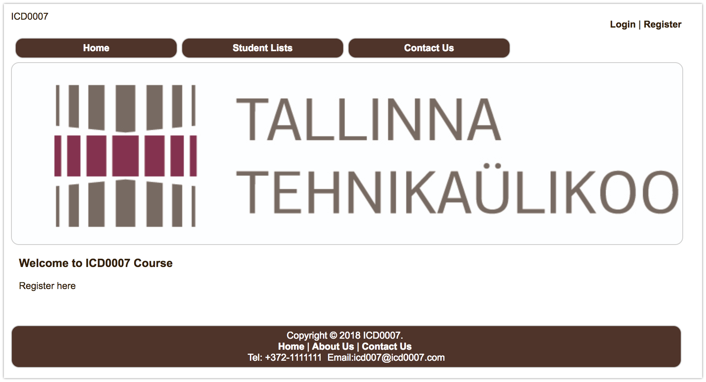
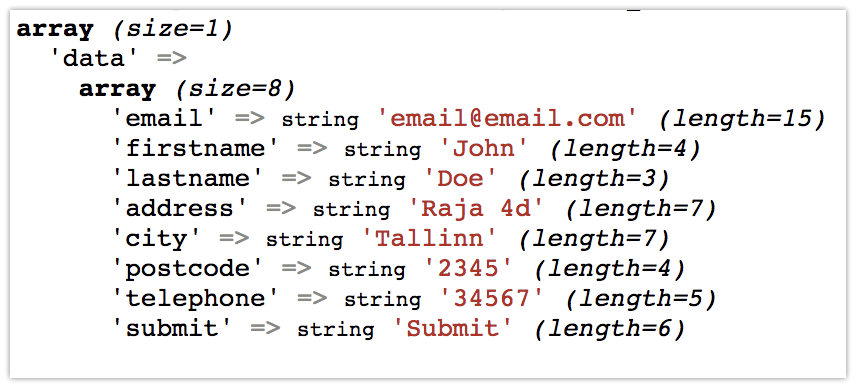

## Building Web App using PHP & MySQL, HTML, CSS, Javascript

In the previous lab sessions and lectures we have seen how to create web pages with **HTLM**, style elements with **CSS** and add some cool interactions with javascript.

Today we will see how we can use PHP on the server side to handle user data submitted from the frontend.

During the lecture, we have learnt PHP basics and during this lab we will build on that knowledge.

#### Getting Started with the sample App

Step 1. Clone or Fork this repository, the skeleton app is located in - `mywebapp`

The app has the structure as below:
    
- `css` - contains styles for the web pages
    
- `images` - contains images
    
- `js` - to hold our javascript codes

- `index.html`

- `login.html`

- `register.html`

- `database.sql` - contains the sql statement to create our MySQL database and table.


Step 2. Add the `mywebapp` folder to `MAMP server site directory`

__**NOTE**__: If you followed the **Dev Environment Setup** guide sent to during the week, you should have this directory already.

In that case, you can just replace it.

    - On Mac - `/Applications/MAMP/htdocs/`

    - On Windows - `C:\MAMP\htdocs\`

If you have another web server `e.g. WAMP(Windows)`, the directory should be something like `C:\wamp\www\`.

Step 3. Visit `http://localhost:8888/mywebapp` (`replace 8888` - if you have a different port) and you should see the image below if everything is okay!



You can click around available link and see what we have there, especially **Login** and **Register**.

#### Working with Registration form

Step 1. Open the project on your code editor and open the file `register.html`

We are interested in the form part as seen below:

```html
    <h2>Sign Up</h2>
    <br/>

    <b>Please enter your information.</b><br/><br/>
    <form action="" method="">
        <p>
            <label>Email: </label>
            <input type="text" name="data[email]"/>
        <p>
        <p>
            <label>First Name: </label>
            <input type="text" name="data[firstname]"/>
        <p>
        <p>
            <label>Last Name: </label>
            <input type="text" name="data[lastname]"/>
        <p>
        <p>
            <label>Address: </label>
            <input type="text" name="data[address]"/>
        <p>
        <p>
            <label>City: </label>
            <input type="text" name="data[city]"/>
        <p>
        <p>
            <label>Postcode: </label>
            <input type="text" name="data[postcode]"/>
        <p>
        <p>
            <label>Telephone: </label>
            <input type="text" name="data[telephone]"/>
        <p>
        <p>
            <input type="reset" name="data[clear]" value="Clear" class="button"/>
            <input type="submit" name="data[submit]" value="Submit" class="button marL10"/>
        <p>
    </form>
```

- To be able to submit this form, we need to add 2 things:

  1. We need to give a value to the action attribute of the form

        - `action="/mywebapp/registerHandler.php"` - This means we have to create a PHP script to handle the form submit.

  2. We need to specify the form submission method

        - `method="POST"` - so that we can use the PHP `$_POST` to retrieve the form's submitted values.


Step 2. Inside your app folder, create a PHP file - `registerHandler.php`

```php
    echo '<br />Submitted Data<hr />';
    var_dump($_POST);
```

You should see something similar to this on your browser




```php
    // You can retrieve each value and assign to variable in your script

    echo ('<br />')
    $postedData = $_POST['data'];

    $email = $postedData['email'];
    $firstname = $_POST['firstname'];
    $lastname = $_POST['lastname'];

    // add the rest
```

#### Write and Read from file

```php
    $data = $_POST['data'];
    $serializedData = serialize($data);

    // write
    $handle = fopen(__DIR__ . '/data.dat', 'w');
    fwrite($handle, $serializedData);
    fclose($handle);

    // get the file content
    $string = file_get_contents(__DIR__ . '/data.dat');
    $data = unserialize($string); // unserialize it
    $output = '';
    foreach ($data as $key => $value) {
        $field = ucwords($key); // make first letter of each word uppercase
        $output .= "$field: $value" . '<br>';
    }
    echo $output;
```


Since we want this user to login in after registration, we add more fields to the form

    - add new input fields `password` and `confirm password`


#### Submit form with Ajax

* Create a file called `main.js` inside the js folder and put the js code below.

```javascript
    $(function () {
        $('form').on('submit', function (e) {
            e.preventDefault();
            $.ajax({
                type: 'POST',
                url: '/mywebapp/indexHandler.php',
                data: $('form').serialize(),
                success: function (response) {
                    console.log(response);
                    alert('form was submitted');
                }
            });
        });
    });
```

* Include jquery file and `main.js` to the `register.html` at the bottom, just before the closing body tag (`</body>`).

    - <script src="https://ajax.googleapis.com/ajax/libs/jquery/3.3.1/jquery.min.js"></script>

    - <script src="js/main.js"></script>

* Also in the `register.html`, you need to remove the action value (`/mywebapp/registerHandler.php`) from the form since we are now submitting via Ajax `<form action="/mywebapp/registerHandler.php" method="POST">`

* Now refresh the register page and submit the form again, you will notice the was submitted but the page was not reloaded.

* Check the browser console to see the response data from the server.
